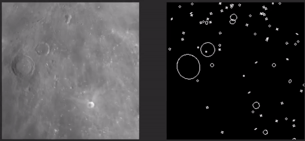

# Crater-Relative Navigation

This repository contains the necessary components to compose a Terrain-Relative Navigation (TRN) pipeline for navigating around the moon at low (<500km) altitudes. It utilizes a crater rim detection method based on UNET (inspired by [DeepMoon](https://github.com/silburt/DeepMoon)) which is then trained to perform its task on simulated monocular camera images. These images are generated using [SurRender](https://www.airbus.com/space/space-exploration/SurRenderSoftware.html), and the training mask is created by projecting the apparent ellipses of craters into the image plane. Identification is done using the method as described in [Christian et al., 2020](https://arxiv.org/abs/2009.01228), which allows the system to create a database of projective invariants that are unique to each (approximately) coplanar crater triad.

More info coming soon...
