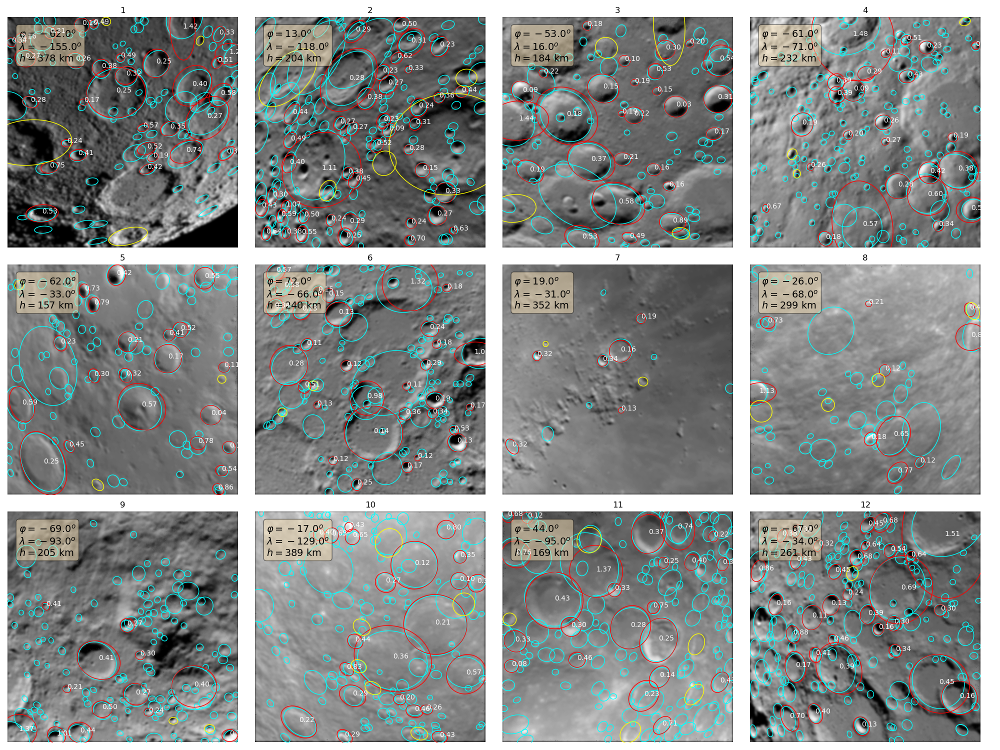
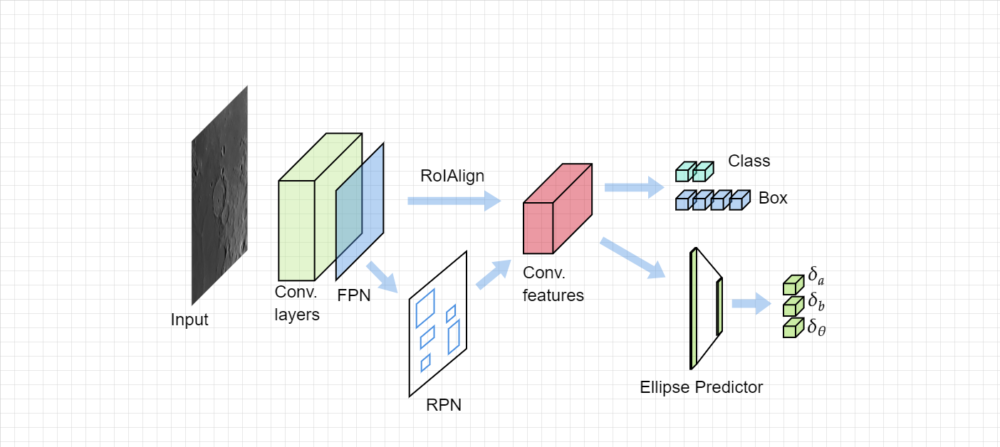

# Lunar Orbit Navigation Using Ellipse R-CNN and Crater Pattern Matching




This repository contains the necessary components to compose a Terrain-Relative Navigation (TRN) pipeline for navigating around the moon at altitudes below 500km. It utilizes a crater rim detection method based on Faster R-CNN & [Ellipse R-CNN](https://arxiv.org/abs/2001.11584) which is then trained to perform its task on simulated monocular camera images. These images are generated using [SurRender](https://www.airbus.com/space/space-exploration/SurRenderSoftware.html), and the training mask is created by projecting the apparent ellipses of craters into the image plane. Identification is done using the method as described in [Christian et al., 2020](https://arxiv.org/abs/2009.01228), which allows the system to create a database of projective invariants that are unique to each (approximately) coplanar crater triad.

*Note: The notebooks in this repository are for development purposes and contain deprecated code - they will be updated in the future to demonstrate the capabilities of the package.*

## Model description

> [!NOTE]  
> If you're looking for the standalone Ellipse R-CNN model, check out [this repository](https://github.com/wdoppenberg/ellipse-rcnn).



## Instructions

This repository uses [git LFS](https://docs.github.com/en/github/managing-large-files/versioning-large-files).

## Dataset creation ([SurRender](https://www.airbus.com/space/space-exploration/SurRenderSoftware.html) server required)
```
usage: create_dataset.py [-h] [--n_train N_TRAIN] [--n_val N_VAL]
                         [--n_test N_TEST] [--identifier IDENTIFIER]
                         [--resolution RESOLUTION] [--fov FOV]
                         [--min_sol_incidence MIN_SOL_INCIDENCE]
                         [--max_sol_incidence MAX_SOL_INCIDENCE]
                         [--ellipse_limit ELLIPSE_LIMIT] [--filled FILLED]
                         [--mask_thickness MASK_THICKNESS]

Create dataset containing input images and relevant ellipses using SurRender.

optional arguments:
  -h, --help            show this help message and exit
  --n_train N_TRAIN     Number of training images (default: 20000)
  --n_val N_VAL         Number of validation images (default: 1000)
  --n_test N_TEST       Number of testing images (default: 1000)
  --identifier IDENTIFIER
                        Number of testing images (default: None)
  --resolution RESOLUTION
                        Camera resolution (default: (256, 256))
  --fov FOV             Camera FoV (default: 45)
  --min_sol_incidence MIN_SOL_INCIDENCE
                        Minimum solar incidence angle (default: 10)
  --max_sol_incidence MAX_SOL_INCIDENCE
                        Maximum solar incidence angle (default: 80)
  --ellipse_limit ELLIPSE_LIMIT
                        Maximum ellipticity for gt ellipse shapes
                        (selenographic) (default: 1.3)
  --filled FILLED       Whether to fill the crater masks or not (default:
                        True)
  --mask_thickness MASK_THICKNESS
                        How thick to make the mask rim if not filled (default:
```

## Model training

Start MLflow server using:
```
mlflow server --backend-store-uri=sqlite:///mlruns.db --default-artifact-root=artifacts
```

After installing all required packages and retrieving the dataset, start training using `train_model.py`:

```
usage: train_model.py [-h] [--epochs EPOCHS] [--batch_size BATCH_SIZE]
                      [--num_workers NUM_WORKERS]
                      [--learning_rate [LEARNING_RATE]] [--backbone BACKBONE]
                      [--run_id [RUN_ID]] [--dataset DATASET]
                      [--momentum MOMENTUM] [--weight_decay WEIGHT_DECAY]
                      [--device DEVICE]

Train the crater detection model on images and target ellipses

optional arguments:
  -h, --help            show this help message and exit
  --epochs EPOCHS       Number of epochs (default: 20)
  --batch_size BATCH_SIZE
                        Batch size (default: 8)
  --num_workers NUM_WORKERS
                        Number of workers for training dataloader (default: 4)
  --learning_rate [LEARNING_RATE]
                        Learning rate (default: 0.001)
  --backbone BACKBONE   Model backbone ResNet type. (default: resnet50)
  --run_id [RUN_ID]     Resume from MLflow run checkpoint (default: None)
  --dataset DATASET     Dataset path (default:
                        data/dataset_crater_detection_40k.h5)
  --momentum MOMENTUM   Momentum input for SGD optimizer. (default: 0.9)
  --weight_decay WEIGHT_DECAY
                        Weight decay input for SGD optimizer. (default: 1e-07)
  --device DEVICE       Device to train model on (`cpu` or `cuda`) (default:
                        cuda)
```


